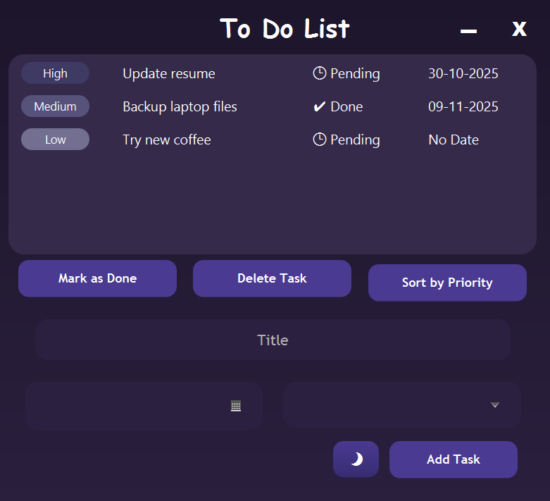

# To-Do List App (JavaFX)

A modern To-Do List application built with **JavaFX and Scene Builder**, designed for simplicity and customization.  
It includes **three themes** (Blue, Lilac, Dark Mode) and a variety of task management features.

---

## ✨ Features

-  **Themes** - Switch between Blue, Lilac, and Dark Mode.
-  **Task Management** - Add, delete, or mark tasks as done.
-  **Sorting & Reordering** - Sort tasks automatically by priority (High, Medium, Low) or arrange manually with drag-and-drop.
-  **Due Dates** - Assign deadlines; tasks without dates show as “No Date.”
-  **Countdown Tooltips** - Hover over a task to see how much time is left until its due date.
-  **Priority Labels** - Clear visual tags for High, Medium, and Low importance.

---

## 📸 Screenshots

| Blue Theme                | Lilac Theme                 | Dark Mode                |
|---------------------------|-----------------------------|--------------------------|
|  |  |  |


---

## 🚀 Getting Started

### Prerequisites
- Java 11+
- JavaFX SDK

### Run the App
1. Clone the repository:
   ```bash
   git clone https://github.com/itshanna27/ToDoList.git
Open the project in IntelliJ IDEA (or another JavaFX-ready IDE).

Run the Main class located at:


src/main/java/com/example/demo/Main.java
🛠️ Built With
JavaFX – UI framework

Scene Builder – Visual layout tool

## 📜 License

Copyright (c) 2025 itsHanna27

This project is provided for personal use only.  
You may view and run the code for learning or personal tasks.

You may NOT:
- Modify the source code
- Redistribute the project
- Claim ownership or credit for this project

All rights reserved.


---

Use this to clone the code! :):

```bash
git clone https://github.com/itsHanna27/ToDoList.git
